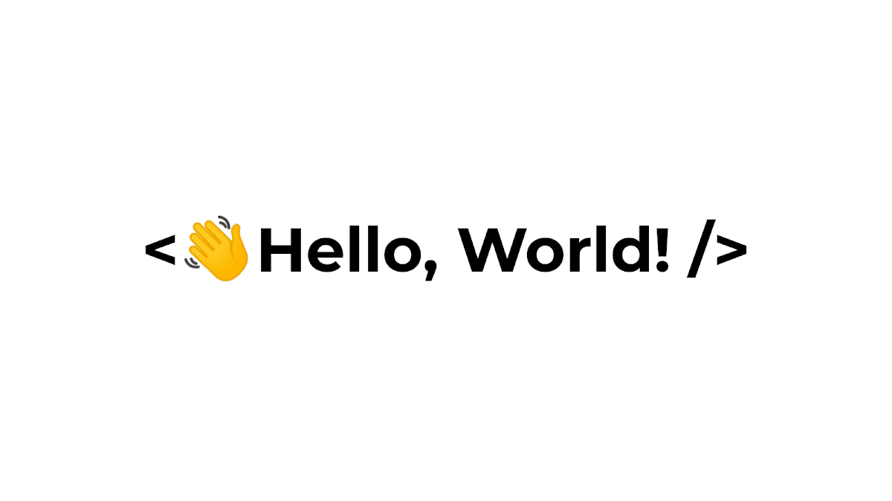

<!-- 

    

 -->

    
    

 
 

<h1 align="center">Hi 👋, I'm Zelda Ababil</h1>
<!-- <h3 align="center">Life is like a class, and you can write functions, then add variables and give a full of happiness in it 😁</h3> -->

  

<!-- 
  
 -->

 

- 🔭 I’m currently working on **JMBDeveloper ✨**

- 🌱 I’m currently learning **Web,Mobile,Machine Learning Development and other programming languages 🤯**

- 💬 Ask me about **Something 🫥**

- 📫 How to reach me **zeldaababil01@gmail.com 👈**

- ⚡ Fun fact **Roses are blue, violets are red, I have to write my Code. 😎**

 
 

<!-- <h3 align="left">Connect with me:</h3> -->
## 🌐 Connect with me:

 
 

<!-- <h3 align="left">Languages and Tools:</h3> -->
# 💻 Tech Stack:

                                   

<!-- 

&nbsp;
 -->

<!-- 

 -->
#
### 😂 Random Dev Meme

---
<!--  -->
